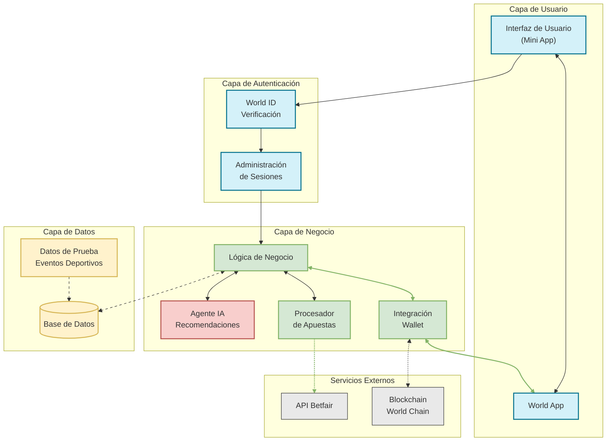

# Arquitectura de BetWorld - Mini App para Apuestas Deportivas

Este diagrama muestra la arquitectura de alto nivel de BetWorld, una mini app que simplifica las apuestas deportivas con criptomonedas mediante la integración con World ID y un agente IA para recomendaciones personalizadas.

## Diagrama de Arquitectura

## Explicación de Componentes

### Capa de Usuario
- **Interfaz de Usuario (Mini App)**: Frontend de React integrado con MiniKit SDK, proporciona una experiencia de usuario fluida para ver eventos deportivos y realizar apuestas en 2 pasos.
- **World App**: Aplicación principal donde se ejecuta nuestra mini app, proporciona acceso a World ID y wallet del usuario.

### Capa de Autenticación
- **World ID Verificación**: Integración real con World ID para verificar que los usuarios son humanos únicos, sin necesidad de KYC tradicional.
- **Administración de Sesiones**: Gestiona las sesiones de usuario tras la verificación con World ID.

### Capa de Negocio
- **Lógica de Negocio**: Núcleo de la aplicación que coordina todas las operaciones.
- **Agente IA (Recomendaciones)**: Analiza eventos deportivos y proporciona recomendaciones personalizadas basadas en el saldo real del usuario.
- **Procesador de Apuestas**: Gestiona la creación, seguimiento y liquidación de apuestas (simulado en MVP V1).
- **Integración Wallet**: Conecta con la wallet de World App para consultar saldos reales y facilitar transacciones.

### Capa de Datos
- **Base de Datos**: Almacena información sobre usuarios, apuestas y eventos (MongoDB/PostgreSQL).
- **Datos de Prueba (Eventos Deportivos)**: Datos simulados de eventos deportivos para el MVP V1, con información realista para la demostración.

### Servicios Externos
- **API Betfair**: En versiones futuras, conexión directa con la API de Betfair para obtener eventos reales y procesar apuestas.
- **Blockchain (World Chain)**: Infraestructura para verificar World ID y, en versiones futuras, procesar transacciones.

## Flujo de Datos Principal

1. El usuario accede a BetWorld desde World App
2. Se verifica su identidad mediante World ID
3. El sistema consulta el saldo real de la wallet del usuario
4. La interfaz muestra eventos deportivos (datos simulados en V1)
5. El agente IA genera recomendaciones personalizadas basadas en el saldo real
6. El usuario selecciona un evento y confirma su apuesta (en solo 2 pasos)
7. El procesador de apuestas registra la operación
8. En versiones futuras, se comunicará con Betfair para procesar apuestas reales

## Notas sobre la Implementación para el MVP V1

- Las líneas sólidas muestran integraciones completas en el MVP V1
- Las líneas punteadas muestran conexiones planificadas para versiones futuras
- La integración con World ID y la wallet de World App es real y funcional
- Los datos de eventos deportivos son simulados pero realistas
- El agente IA usa algoritmos simples con datos simulados en V1

Este enfoque de arquitectura nos permite entregar un MVP funcional en 48 horas mientras sentamos las bases para una plataforma completa de apuestas deportivas con criptomonedas.